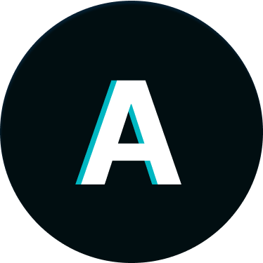

  
  <h1>Ali Reza</h1>
  

    
    
  

## My Journey for building my *Portfolio*

### `01/06/2023`
- I've started designing the portfolio in [Figma](https://www.figma.com/file/ttikGrStgEATuF32JIpLb2/Untitled?node-id=0%3A1&t=bMekbk4bvVmGGv0g-1)
- I've designed the Navbar ✅
- I've designed the Header ✅
- I've designed the Skills ✅

### `01/07/2023`
