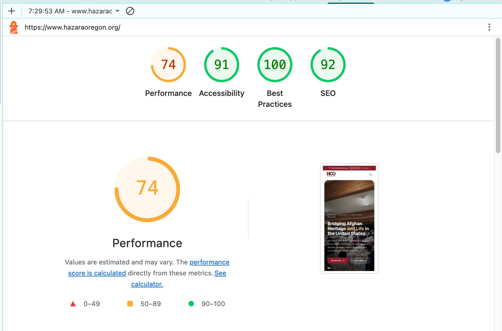
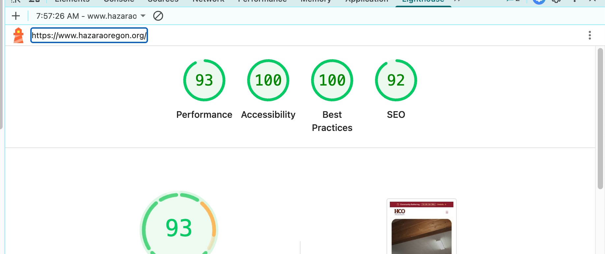
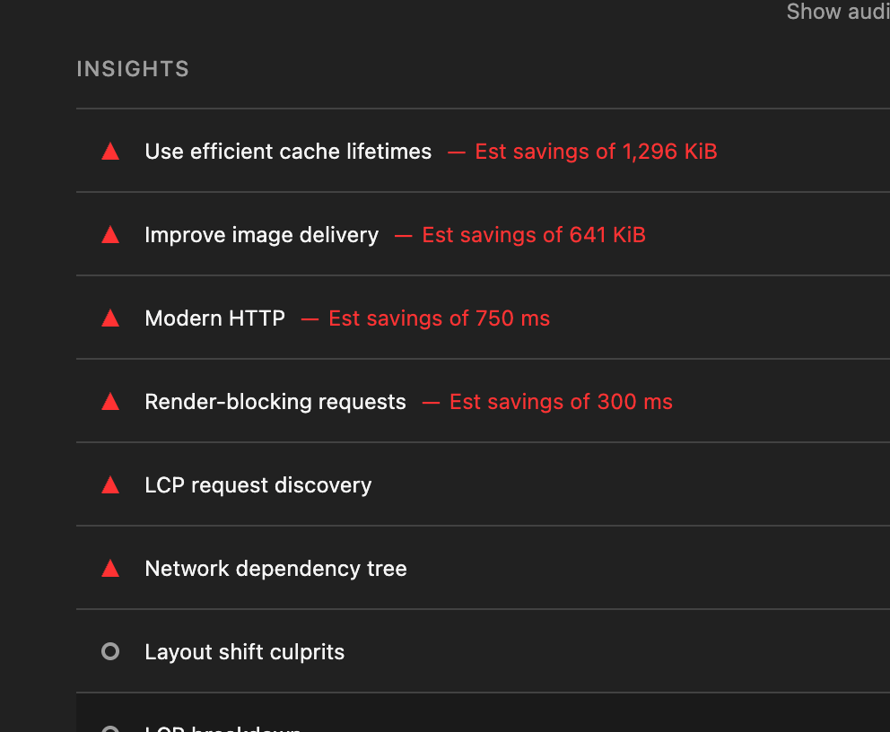
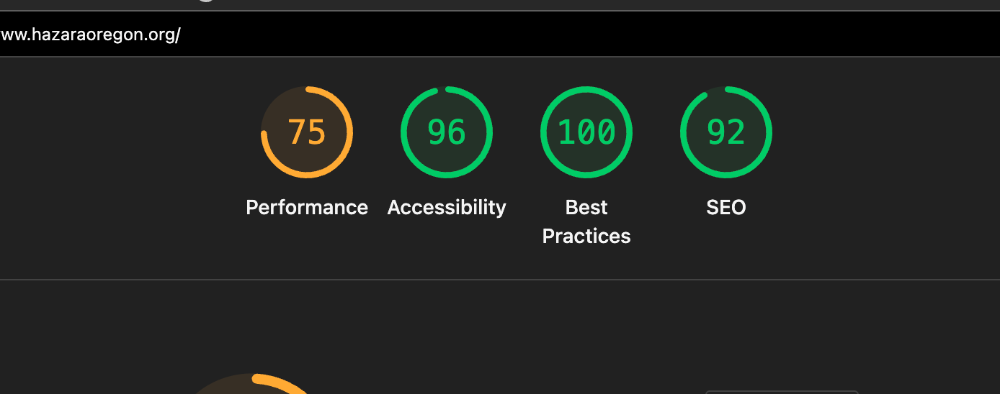

# Case Study: Making hazaraoregon.org Fast

A record of how we took the Hazara Community of Oregon website from a slow, sluggish
homepage to a fast one — the numbers, the causes, and every fix we shipped. Written so I
can turn it into a client-facing blog post later.

> **Why this matters to me:** I genuinely care about the performance of your website. A
> pretty site that loads slowly still loses visitors, donations, and Google rankings.
> Speed isn't a nice-to-have I tack on at the end — it's part of the build.

---

## The results (before → after)

| Metric                             | Before | After   |
| ---------------------------------- | ------ | ------- |
| **Performance**                    | 74     | **93**  |
| **Accessibility**                  | 91     | **100** |
| **Best Practices**                 | 100    | **100** |
| **SEO**                            | 92     | **92**  |
| **Largest Contentful Paint (LCP)** | 19.9s  | **~2s** |
| **Total Blocking Time**            | 100ms  | **0ms** |

All numbers are from Google Lighthouse (mobile), the same tool Google uses to judge page
experience.

**Before:**

**After:**

---

## What was actually slow

We started by reading the full Lighthouse report instead of guessing. One number stood
out: **Largest Contentful Paint of 19.9 seconds.** LCP is how long it takes the main
image to show up — for a visitor, it's how long the page looks broken.

The cause wasn't mysterious. It was a single file:

- The homepage hero image was a **2.7 MB raw JPG** (4032×3024 — straight off a phone camera).
- On a mobile connection, that one image accounted for roughly **90% of the load problem.**

Everything else was smaller, ordinary issues stacked on top: images with no set dimensions,
tap targets too small for a thumb, links Google couldn't read, and no browser hints telling
the page what to load first.

---

## What we did — step by step

### 1. Fixed the one image that mattered most

Converted the 2.7 MB hero JPG to WebP (a modern, far smaller format) and resized it sanely.
**2,779 KB → 231 KB.** That alone took LCP from 19.9s down to 8.9s.

### 2. Told the browser what to load first

A fast image is wasted if the browser finds it late. We added:

- `fetchpriority="high"` and eager loading on the hero, so it downloads immediately.
- A **preload** hint in the page head, so the browser starts fetching it before it even
  finishes reading the page.
- A **preconnect** to the image host, so the network handshake happens in advance instead
  of mid-load.

### 3. Optimized every other image on the site

Not just the hero — all **24 images** across the site were re-encoded to WebP and right-sized.
**5.71 MB → 3.21 MB total (−43%).** Some raw photos shrank by up to 90%.

### 4. Made everything below the fold lazy-load

Images further down the page now load only as the visitor scrolls to them, so the first
screen isn't waiting on things nobody's looking at yet. The hero images stay eager on
purpose — lazy-loading the main image would slow the very thing we just fixed.

### 5. Cleared the accessibility issues

Accessibility went **91 → 100** by fixing:

- **Touch targets** — the small carousel dots were too tiny to tap reliably; enlarged to a
  proper 24px hit area.
- **Descriptive links** — six "Learn More" links Google and screen readers couldn't tell
  apart now say what they lead to.
- **Image dimensions** — added explicit width/height so the layout doesn't jump as images load.
- **The logo link** — added a proper accessible label.

---

## The honest part: what's left

The site is fast, but Lighthouse still flags two things we _can't_ fix in code alone:
**cache lifetimes** and **modern HTTP**. Both come from where the images are currently
hosted (an R2 public dev URL), which doesn't send long cache headers or serve over the
newest, fastest protocols.

The fix is an infrastructure change — serving the images through a proper Cloudflare custom
domain — which unlocks long-term caching, HTTP/2/3, and on-the-fly resizing in one move.
That's the next lever if we want to push Performance past 93.

---

## The takeaway

Slow websites are almost never one mysterious problem. They're a short list of ordinary,
fixable ones — and the biggest win here was a single oversized image. The trick isn't magic;
it's measuring first, fixing the thing that actually costs seconds, and building lean so it
stays fast.

This is the standard I hold every site I build to. I care about the performance of your
website because your visitors do — even if they'd never use the word "LCP."
